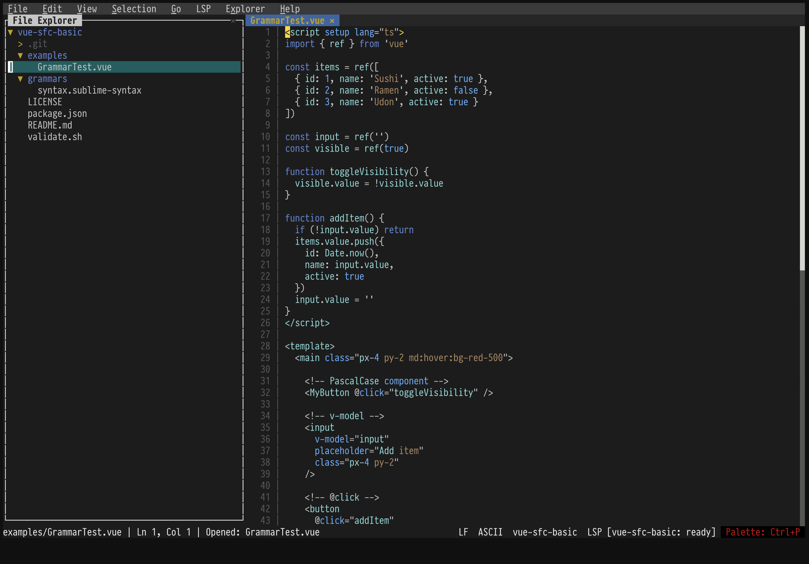
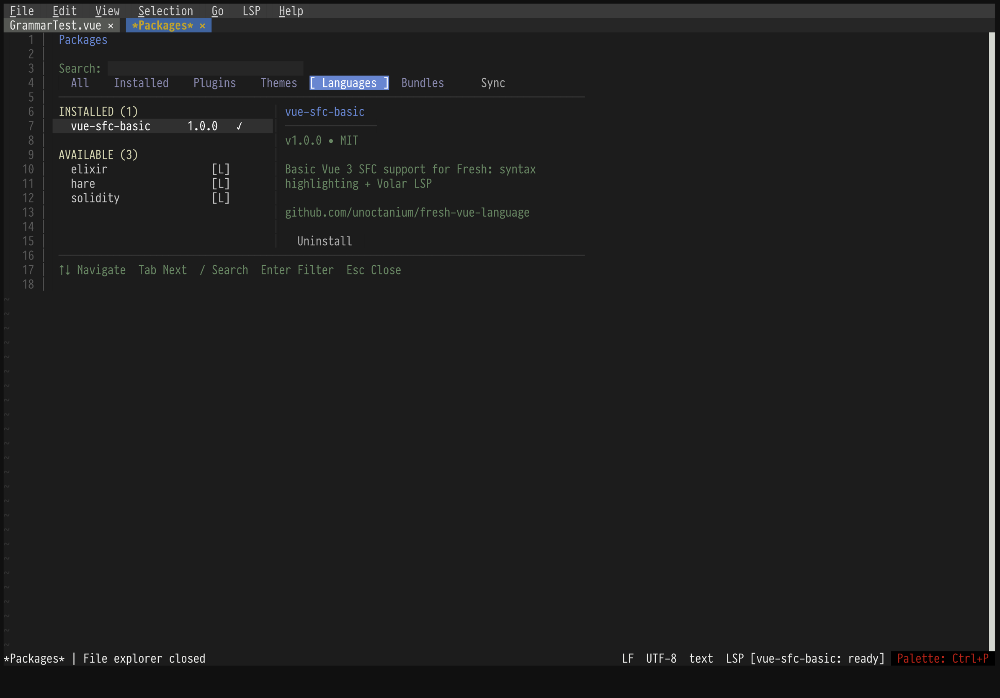

# Vue SFC Basic Language Pack for Fresh Editor

Lightweight Vue 3 Single File Component (SFC) support for the Fresh editor.

## Preview 1: Vue SFC Highlighting



## Preview 2: Package installation page


 
## Why this package exists

Fresh currently supports syntect-compatible grammars.
Most Vue grammars rely on advanced Sublime/TextMate features and fail to parse.

This is intentionally a **syntect-compatible basic grammar** optimised for Fresh.
It avoids advanced Sublime/TextMate constructs (`extends`, injections, etc.)
that Fresh currently cannot parse reliably.

This package provides **stable, Fresh-native Vue highlighting** without dependencies.

## Features

- Syntax highlighting for `.vue` files:
  - `<script>` (TypeScript / JavaScript – lightweight tokenization)
  - `<template>` (HTML + Vue directives + mustache `{{ ... }}`)
  - `<style>` (basic CSS scope)
- LSP integration via Volar (`vue-language-server`)

## Installation

## LSP Setup (Volar)

Install the Vue language server globally:

```bash
npm i -g @vue/language-server typescript
```

Verify:
    
```bash
which vue-language-server
```

### Vue Syntax from URL

In Fresh: Command Palette → **Package: Install from URL**

Use:
https://github.com/unoctanium/fresh-vue-language

Then quit / restart fresh

## Notes / Limitations

Fresh syntax highlighting is syntect-compatible, so grammars that rely on advanced Sublime features
(e.g. extends) often fail to parse. This pack is intentionally self-contained.

## Development

Validate:
    
```bash
./validate.sh
```

Test by installing from local path (recommended during development):
- Command Palette → Package: Install from URL
- Enter full path to the pack directory

Then check logs / warnings inside Fresh.

